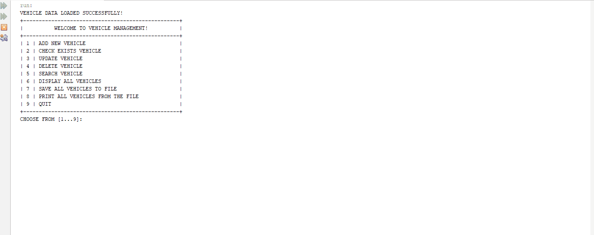

<!-- Improved compatibility of back to top link: See: https://github.com/othneildrew/Best-README-Template/pull/73 -->

<!--
*** Thanks for checking out the Best-README-Template. If you have a suggestion
*** that would make this better, please fork the repo and create a pull request
*** or simply open an issue with the tag "enhancement".
*** Don't forget to give the project a star!
*** Thanks again! Now go create something AMAZING! :D
-->

<!-- PROJECT SHIELDS -->
<!--
*** I'm using markdown "reference style" links for readability.
*** Reference links are enclosed in brackets [ ] instead of parentheses ( ).
*** See the bottom of this document for the declaration of the reference variables
*** for contributors-url, forks-url, etc. This is an optional, concise syntax you may use.
*** https://www.markdownguide.org/basic-syntax/#reference-style-links
-->
[![Contributors][contributors-shield]][contributors-url]
[![FPT][FPT-shield]][FPT-url]

[![LinkedIn][linkedin-shield]][linkedin-url]

<!-- PROJECT LOGO -->
 

  

<h3 align="center">Vehicle Management System</h3>

  

A comprehensive vehicle management system designed to efficiently manage various types of vehicles. 
     
    <a href="https://github.com/TranLuan2907/vehicle-management"><strong>Explore the docs »</strong></a>
     
     
    <a href="https://github.com/TranLuan2907/vehicle-management">View Demo</a>
    ·
    <a href="https://github.com/TranLuan2907/vehicle-management/issues">Report Bug</a>
    ·
    <a href="https://github.com/TranLuan2907/vehicle-management-/issues">Request Feature</a>
  

<!-- TABLE OF CONTENTS -->

  
Table of Contents

  <ol>
    <li>
      <a href="#about-the-project">About The Project</a>
      <ul>
        <li><a href="#built-with">Built With</a></li>
      </ul>
    </li>
    <li>
      <a href="#getting-started">Getting Started</a>
      <ul>
        <li><a href="#prerequisites">Prerequisites</a></li>
        <li><a href="#installation">Installation</a></li>
      </ul>
    </li>
    <li><a href="#usage">Usage</a></li>
    <li><a href="#roadmap">Roadmap</a></li>
    <li><a href="#contributing">Contributing</a></li>
    <li><a href="#license">License</a></li>
    <li><a href="#contact">Contact</a></li>
    <li><a href="#acknowledgments">Acknowledgments</a></li>
  </ol>

<!-- ABOUT THE PROJECT -->
## About The Project

[![Product Name Screen Shot][product-screenshot]]()
[![Product Name Screen Shot][product-screenshot2]]()
[![Product Name Screen Shot][product-screenshot3]]()

This project serves as an assignment for the LAB211 - OOP with Java Lab course at FPT University. Students are tasked with applying the Java programming knowledge acquired in the pre-requisite course, PRO192 (Programming OOP with Java), to develop a practical, real-life application.

**In this assignment, I built the project using the <code style='color: cyan'>Stream API</code> and <code style='color: cyan'>Lambda Expressions</code> instead of traditional foreach loops and sorting methods.**

(<a href="#readme-top">back to top</a>)

### Built With

* [![Java][Java.com]][Java-url]

(<a href="#readme-top">back to top</a>)

<!-- GETTING STARTED -->
## Getting Started

To run the project, you need to follow these steps.

### Prerequisites

1. Firstly, you need to install JDK (Java Development Kit) which plays an important role in providing necessary tools and libraries to execute the code.

2. After you have downloaded and installed JDK,  you will need to go through the same process with an IDE (Integrated development environment).

There are many IDEs now available on the internet to run Java code, such as VSCode, Eclipse, ... but I highly recommend **Netbeans** or **IntelliJ** due to their stability."

Finally, download this project to your computer, extract it and run with the IDE that you have just installed

In the project, locate the 'VehicleManagementSystem' class. This class serves as the main class and functions as the entry point of the program. Select the 'VehicleManagementSystem' class, run it, and you are good to go!

### Installation

* Click [Here](https://www.oracle.com/java/technologies/downloads/) to download and install the JDK 

* Click [Here](https://www.jetbrains.com/idea/download/?section=windows) to download and install Intellij IDEA

OR
* Click [Here](https://netbeans.apache.org/front/main/) to download and install NetBeans

Notice that if you are accustomed to using another IDE not listed here, feel free to use it anyway.

(<a href="#readme-top">back to top</a>)

<!-- USAGE EXAMPLES -->
## Usage

Below is a demonstration of the project, showcasing the implementation of data validations.

(<a href="#readme-top">back to top</a>)

<!-- CONTRIBUTING -->
## Contributing

Contributions are what make the open source community such an amazing place to learn, inspire, and create. Any contributions you make are **greatly appreciated**.

If you have a suggestion that would make this better, please fork the repo and create a pull request. You can also simply open an issue with the tag "enhancement".
Don't forget to give the project a star! Thanks again!

1. Fork the Project
2. Create your Feature Branch (`git checkout -b feature/AmazingFeature`)
3. Commit your Changes (`git commit -m 'Add some AmazingFeature'`)
4. Push to the Branch (`git push origin feature/AmazingFeature`)
5. Open a Pull Request

(<a href="#readme-top">back to top</a>)

<!-- LICENSE -->
## License

Distributed under the MIT License. See `LICENSE.txt` for more information.

(<a href="#readme-top">back to top</a>)

<!-- CONTACT -->
## Contact
**Tran Ngoc Kinh Luan**
- LinkedIn: [@luantran2907](https://www.linkedin.com/in/luantran2907/)
- Email: luantnkse184059@fpt.edu.vn

Project Link: [Vehicle Management](https://github.com/TranLuan2907/vehicle-management)

(<a href="#readme-top">back to top</a>)

<!-- ACKNOWLEDGMENTS -->
## Acknowledgments
I would like to express my greatest gratitude to the following resources from the internet that have been instrumental in the development of the project.

* [Choose an Open Source License](https://choosealicense.com)
* [GitHub Emoji Cheat Sheet](https://www.webpagefx.com/tools/emoji-cheat-sheet)
* [Malven's Flexbox Cheatsheet](https://flexbox.malven.co/)
* [Malven's Grid Cheatsheet](https://grid.malven.co/)
* [Img Shields](https://shields.io)
* [GitHub Pages](https://pages.github.com)
* [Font Awesome](https://fontawesome.com)
* [React Icons](https://react-icons.github.io/react-icons/search)

Last but not least, I want to express my sincere gratitude to my teacher, **HoangNT2**, also known as **Nguyễn Thế Hoàng**. He has been my favorite teacher since my time at FPT University.

His enthusiasm and dynamic teaching methods have played an indispensable role in motivating students to become passionate about what they are doing. Despite not having met him in person, I've gained a wealth of valuable knowledge through his YouTube channel.

Be sure to check out his insightful content on [Youtube](https://www.youtube.com/@giaolang)!

**HAPPY CODE | HAPPY MONEY | HAPPY LIFE**

(<a href="#readme-top">back to top</a>)

<!-- MARKDOWN LINKS & IMAGES -->
<!-- https://www.markdownguide.org/basic-syntax/#reference-style-links -->

[contributors-shield]: https://img.shields.io/badge/Contributor-1-dark%20green?style=for-the-badge

[contributors-url]: https://github.com/TranLuan2907/flight-management-system/graphs/contributors
[forks-shield]: https://img.shields.io/github/forks/github_username/repo_name.svg?style=for-the-badge
[forks-url]: https://github.com/github_username/repo_name/network/members
[stars-shield]: https://img.shields.io/github/stars/github_username/repo_name.svg?style=for-the-badge
[stars-url]: https://github.com/github_username/repo_name/stargazers
[issues-shield]: https://img.shields.io/github/issues/github_username/repo_name.svg?style=for-the-badge
[issues-url]: https://github.com/github_username/repo_name/issues
[license-shield]: https://img.shields.io/github/license/github_username/repo_name.svg?style=for-the-badge
[license-url]: https://github.com/github_username/repo_name/blob/master/LICENSE.txt
[linkedin-shield]: https://img.shields.io/badge/-LinkedIn-black.svg?style=for-the-badge&logo=linkedin&colorB=555
[linkedin-url]: https://linkedin.com/in/luantran2907
[product-screenshot]: ./images/J1.L.P0027-Vehicle%20Management-400_page-0001.jpg
[product-screenshot2]: ./images/J1.L.P0027-Vehicle%20Management-400_page-0002.jpg
[product-screenshot3]: ./images/J1.L.P0027-Vehicle%20Management-400_page-0003.jpg
[Next.js]: https://img.shields.io/badge/next.js-000000?style=for-the-badge&logo=nextdotjs&logoColor=white
[Next-url]: https://nextjs.org/
[React.js]: https://img.shields.io/badge/React-20232A?style=for-the-badge&logo=react&logoColor=61DAFB
[React-url]: https://reactjs.org/
[Vue.js]: https://img.shields.io/badge/Vue.js-35495E?style=for-the-badge&logo=vuedotjs&logoColor=4FC08D
[Vue-url]: https://vuejs.org/
[Angular.io]: https://img.shields.io/badge/Angular-DD0031?style=for-the-badge&logo=angular&logoColor=white
[Angular-url]: https://angular.io/
[Svelte.dev]: https://img.shields.io/badge/Svelte-4A4A55?style=for-the-badge&logo=svelte&logoColor=FF3E00
[Svelte-url]: https://svelte.dev/
[Laravel.com]: https://img.shields.io/badge/Laravel-FF2D20?style=for-the-badge&logo=laravel&logoColor=white
[Laravel-url]: https://laravel.com
[Bootstrap.com]: https://img.shields.io/badge/Bootstrap-563D7C?style=for-the-badge&logo=bootstrap&logoColor=white
[Bootstrap-url]: https://getbootstrap.com
[JQuery.com]: https://img.shields.io/badge/jQuery-0769AD?style=for-the-badge&logo=jquery&logoColor=white
[JQuery-url]: https://jquery.com

[Java.com]: https://img.shields.io/badge/Java-ED8B00?style=for-the-badge&logo=openjdk&logoColor=white
[Java-url]: https://www.java.com/en/

[FPT-url]:https://daihoc.fpt.edu.vn/
[FPT-shield]: https://img.shields.io/badge/FPT-Pass-dark%20green?style=for-the-badge

